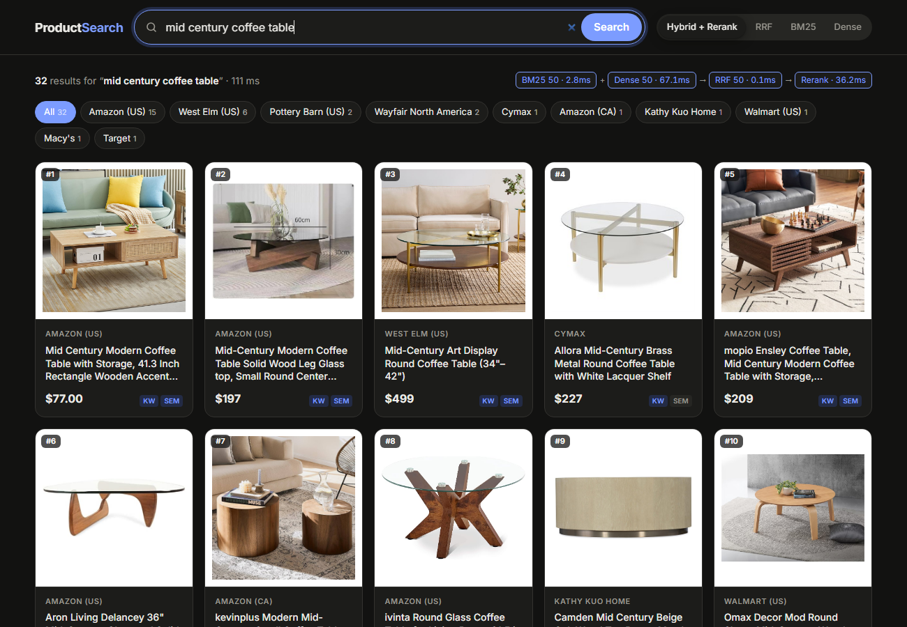

# Product Search

A multi-stage hybrid search engine over a 423k-product e-commerce catalog, with a web UI
that shows how each retrieval stage contributes to the final ranking.



## How it works

```
                ┌─ BM25 (keyword) top-50 ──┐
query ──────────┤                          ├─ Reciprocal Rank Fusion ─ cross-encoder rerank ─ results
                └─ dense (FAISS) top-50 ───┘
```

| Stage | Model / method | What it's good at |
| --- | --- | --- |
| BM25 | `bm25s` over product titles | Exact brands, model numbers, specs |
| Dense | `all-MiniLM-L6-v2` + FAISS `IndexFlatIP` | Synonyms, paraphrases, category-level intent |
| RRF | `Σ 1 / (60 + rank)` | Merges the two candidate pools, whose failure modes barely overlap |
| Rerank | `cross-encoder/ms-marco-MiniLM-L-6-v2` | Jointly scores (query, title) to fix the final order |

On the Amazon ESCI benchmark (8,955 judged queries, 1.2M products), the full pipeline
improves Hits@1 from 0.296 (BM25 alone) to **0.374** and MRR@10 from 0.385 to **0.474**.
See [the pipeline write-up](search_pipeline/README.md) for the experiments,
error analysis, and design decisions.

Warm queries take about 110 ms end to end on a laptop GPU (RTX 5050).

## The search UI

- **Stage switcher:** rank by the full pipeline, RRF only, BM25 only, or dense only, so
  you can compare the stages on the same query.
- **Retrieval badges:** `KW` / `SEM` on each result show which retriever found it.
- **Pipeline trace:** the detail panel shows the product's rank at every stage.
- Per-stage latency, store filters, dark mode, and a responsive layout.

## Image search

[`image_search/`](image_search/README.md) adds search by text or photo over the 23.8k
products with images. Its README walks through how the design changed as the measurements
improved:

1. **First,** I compared one shared image-text model (CLIP, SigLIP, SigLIP 2) with separate
   models per modality (MiniLM for text, DINOv2 for images). SigLIP beat CLIP by a wide
   margin, and fusing MiniLM title matches with SigLIP photo matches by rank (RRF) looked best.
2. **Then** I tested with realistic LLM-written shopper queries, and found that rank fusion
   **collapses on queries that describe the photo** ("white star sneakers with green accents").
   Title search guesses badly on those, and RRF gives its guesses equal say.
3. **To rule out the benchmark,** I had one model write all the queries, offloading generation
   to the LunaRoute LLM gateway (2 minutes instead of over an hour on my laptop). The failure
   held.
4. **So I changed the fusion.** Weighting ranks didn't help. Blending normalized similarity
   *scores* (70% photo, 30% title) did, because it keeps each side's confidence.
5. **Finally,** brand / model-number queries confirmed the title side is worth keeping. The
   blend beats both sides on those too.

**Where it ended up:** on held-out products, mean MRR@10 rose from 0.527 (equal-weight RRF) to
0.624 (score blend), with no query type where it collapses.

## Repo layout

```
search_pipeline/               retrieval pipeline + offline evaluation on ESCI
  src/bm25/                    BM25 retriever
  src/dense/                   sentence-transformer + FAISS retriever
  src/hybrid/                  RRF fusion + cross-encoder rerank
search_app/                    web UI over a product catalog, built on the pipeline
  build_index.py               builds BM25 + dense indexes from the catalog CSVs
  app.py                       Flask API server
  static/index.html            search page
image_search/                  text + photo search with CLIP / SigLIP / DINOv2, and their evaluation
```

## Running it

```powershell
pip install bm25s pandas pyarrow numpy faiss-cpu sentence-transformers torch flask
```

The product catalog is not included in this repo. Put it in `data/`:

```
data/
├── product_catalog_10_17_24.csv        # required: one row per product
├── *_enriched_descriptions.csv         # optional: AI summaries for the detail panel
└── product_images/product_images/      # optional: local images, else remote URLs are used
```

Then:

```powershell
python search_app/build_index.py   # one-time: ~2 min on GPU
python search_app/app.py           # open http://127.0.0.1:5000
```

To reproduce the ESCI evaluation, see
[search_pipeline/README.md](search_pipeline/README.md#reproducing-the-results).

## License

MIT
