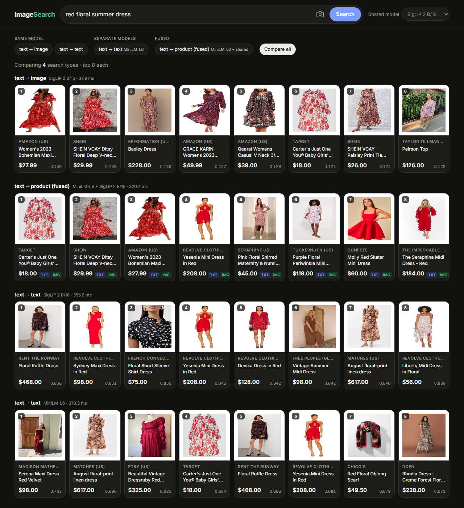

# Image Search

Search the product catalog by text or photo. This part compares two designs:

- **Same model:** one model (CLIP, SigLIP, or SigLIP 2) embeds both images and text into
  one shared space, so a text query can search photos directly.
- **Separate models:** a text-only model (MiniLM) and an image-only model (DINOv2), each
  searching its own modality.



## The six search types

| # | Search type | Design | Model(s) |
| --- | --- | --- | --- |
| 1 | text → image | same model | CLIP ViT-B/32, SigLIP B/16, SigLIP 2 B/16 |
| 2 | image → text | same model | same three |
| 3 | text → text | same model (its text tower) | same three |
| 4 | image → image | same model (its image tower) | same three |
| 5 | text → text | separate models | MiniLM-L6 (`all-MiniLM-L6-v2`, same as `search_app`) |
| 6 | image → image | separate models | DINOv2 B/14 |

A separate-models setup can't search across modalities on its own, because its two spaces
aren't comparable. The closest it gets is a **fused** text search: MiniLM over titles plus
a shared model over photos, merged with reciprocal rank fusion (RRF), the same fusion
`search_app` uses.

## Results

Gallery: the 23,807 catalog products that have a local photo, de-duplicated by image and by
title. Queries: 2,000 products sampled at random, seed 0. There are no human relevance labels for
this catalog, so each query has exactly one correct answer, the product it came from:

- **Text queries** are the AI-written product descriptions (for example *"Boys' Santa-themed
  loungewear set with red and white stripes…"*). They were written separately from the title,
  so text → title is not string matching.
- **Image queries** for image → image are an altered copy of the product photo (random 60–90%
  crop, maybe a flip, brightness and color shift, JPEG re-compression). For image → text the
  query is the original photo.

**MRR@10** (R@1 / R@10 are in [results/results.md](results/results.md)):

| Search type | CLIP B/32 | SigLIP B/16 | SigLIP 2 B/16 | Separate model |
| --- | --- | --- | --- | --- |
| text → image | 0.278 | **0.708** | 0.700 | n/a |
| image → text | 0.205 | 0.611 | **0.635** | n/a |
| text → text | 0.595 | 0.684 | 0.680 | **0.696** (MiniLM) |
| image → image | 0.835 | 0.921 | 0.955 | **0.990** (DINOv2) |
| text → product, fused with MiniLM | 0.539 | **0.756** | 0.754 | n/a |

What this shows:

- **SigLIP is far ahead of CLIP B/32 across modalities**, with text → image R@1 of 0.62 vs 0.20.
  CLIP B/32's text tower handles long, detailed descriptions poorly. SigLIP and SigLIP 2
  are about tied overall: SigLIP 2 does better when the query is an image, and SigLIP 1 is
  slightly better for text → image. The UI defaults to SigLIP 2.
- **In each modality, a dedicated model beats the shared one:** DINOv2 beats every shared
  model on image → image, and MiniLM edges them on text → text with 22M parameters, a fraction of a SigLIP text tower's size.
- **Fusing both designs works best for text search.** MiniLM titles + SigLIP photos reach
  R@1 0.686 and R@10 0.907, beating either alone, because titles and photos fail on
  different products.

Caveats:

- The AI descriptions were probably written while looking at the photo (they mention
  colors), which helps text → image.
- The image → image test checks robustness to crops and color changes (near-duplicate
  matching), which is exactly what DINOv2 is trained for. It does not measure whether
  "more like this" finds *different* products in the same style. Check that by eye in the UI.

## Running it

Needs the catalog corpus from `search_app` first (`python search_app/build_index.py`).

```powershell
pip install transformers sentencepiece pillow torch sentence-transformers flask pandas pyarrow
python image_search/build_index.py   # embeds 23.8k photos + titles with 5 models, ~15 min on GPU
python image_search/evaluate.py      # writes results/results.md and results.json
python image_search/app.py           # open http://127.0.0.1:5001
```

`build_index.py --models siglip2-b16 minilm` builds only some models. The app loads
whichever models have embeddings.

## The UI

- Type a description, **drop / paste / upload a photo**, or click **More like this** on
  any result to search with that product's photo.
- Search-type chips switch between the six types (only the ones that fit the query
  appear). **Compare all** shows the top 8 of each type side by side.
- **Shared model** picks CLIP, SigLIP, or SigLIP 2 for the same-model and fused types.
- On fused results, `TXT` / `IMG` tags show which side found each product.
- `?q=...&type=t2i&compare=1&model=clip-b32` in the URL runs a search on page load.

## Files

```
image_search/
  encoders.py      model registry + text/image embedding (CLIP, SigLIP, DINOv2, MiniLM)
  build_index.py   gallery + cached embeddings in artifacts/ (git-ignored)
  evaluate.py      the six search types + fused, R@1 / R@10 / MRR@10
  app.py           Flask API (port 5001)
  static/          search page
  results/         evaluation output
```
