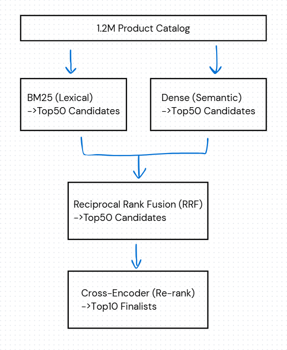

# Semantic Product Search Pipeline

This project builds a semantic product search system over Amazon's ESCI product catalog and quantifies retrieval quality against provided judged queries.

## Overview

This is a BM25 + dense retrieval + RRF + cross-encoder pipeline evaluated on 8,955 judged US queries. The system is fully reproducible from a single entrypoint and includes a swappable embedding-model layer for controlled experimentation.

My goal was to create a multi-stage retrieval pipeline that combines keyword search, semantic search, and a final reranker.



---

## Architecture: each stage solves a different retrieval problem

The pipeline evolved from a pure lexical baseline into a multi-stage retrieval architecture where each component solves a structurally different problem:

- **BM25** handles **exact lexical precision** — matches on brand, model number, dimension strings, and specs.
- **Dense retrieval** expands **semantic recall** — surfaces synonyms, category-level matches, and paraphrased intent.
- **RRF** merges **complementary candidate sets** — exploits the fact that lexical and semantic failure modes are largely uncorrelated.
- **Cross-encoder** optimizes **final ranking precision** — re-scores a small, high-recall candidate pool with a model that jointly attends over `(query, title)` pairs.

---

## Dataset & EDA: observations that shaped design decisions

The `inspect_raw_dataset(...)` pass in `src/data/inspect_data.py` runs at the start of every execution and prints to the run log. The numbers below came directly from that pass and drove three of the most important engineering decisions in the project.

### 1. Short-query dominance explains BM25's strength

Query length on the US small-version test split:

- Mean: **3.89 tokens**
- Median: **4 tokens**
- Example: `#5 machine screws` → 5 tokens

This strongly favors lexical retrieval because user searches are often literal: product specs, model numbers, brands, and noun phrases use terminology that demands exact token overlap.

### 2. ESCI label imbalance shapes what “relevant” rewards

The label distribution is heavily weighted toward exact matches:

| Label | Pct   | Meaning    |
| ----- | ----: | ---------- |
| E     | 65.2% | Exact      |
| S     | 21.9% | Substitute |
| I     | 10.0% | Irrelevant |
| C     |  2.9% | Complement |

Implications:

- Retrieval systems are rewarded heavily for surfacing the literal product the user typed.
- Semantic broadening — surfacing close substitutes — can *hurt* strict metrics even when it would be the right user experience.
- This partially explains why dense retrieval improves recall-oriented metrics like Hits@10 but initially struggles to beat BM25 on Hits@1: it retrieves semantically adjacent substitutes that the strict judgment set marks as wrong.

Dataset weaknesses:

- **Incomplete relevance coverage.** ESCI only contains manually judged query-product pairs, not exhaustive relevance labels across the entire catalog. A product marked as “not retrieved” is not necessarily irrelevant; it may simply never have been labeled during dataset construction. This introduces evaluation bias, especially for semantic retrieval systems that surface valid substitutes outside the judged pool.
- **Dataset-to-domain transfer risk.** ESCI is built around Amazon shopping behavior, product taxonomy, and user intent patterns. An optimized pipeline on ESCI does not automatically guarantee the same retrieval quality for a different domain, such as industrial product search. Real validation would require domain-specific evaluation with internal product data, user feedback, and production search behavior.

### 3. Title-only retrieval was empirically justified

Product field completeness on the US locale:

| Field                  | Pct filled |
| ---------------------- | ---------: |
| `product_title`        |     100.0% |
| `product_brand`        |      94.1% |
| `product_bullet_point` |      85.3% |
| `product_color`        |      66.6% |
| `product_description`  |      53.1% |

> Retrieval quality improvements often come more from consistent, high-quality signals than from blindly concatenating additional sparse metadata.

Concatenating description, bullets, and color into a single retrieval field would introduce sparse-field bias: products with rich metadata look “longer” to BM25 and become artificially favored. Embedding cost also scales with token count. Title-only retrieval keeps the signal distribution uniform across the catalog and is justified by the completeness numbers.

---

## Headline results

Latest run on the US small-version test split: 8,955 evaluated queries over a catalog of 1,215,854 US products. The table below uses strict ground truth, where only `E` labels count as relevant.

| Iteration                      | Hits@1 | Hits@5 | Hits@10 | MRR@10 |
| ------------------------------ | -----: | -----: | ------: | -----: |
| BM25                           |  0.296 |  0.502 |   0.581 |  0.385 |
| Dense (MiniLM-L6 + IP)         |  0.249 |  0.462 |   0.560 |  0.340 |
| Dense (BAAI bge-small-en-v1.5) |  0.286 |  0.498 |   0.594 |  0.378 |
| RRF (dense, BM25)              |  0.315 |  0.532 |   0.630 |  0.413 |
| RRF + cross-encoder rerank     |  0.374 |  0.612 |   0.685 |  0.474 |

End-to-end runtime on a single workstation is ~22 minutes, with corpus embedding as the dominant cost at ~7 minutes on GPU. With caches reused, runtime drops to ~12 minutes.

The **single largest lift in the pipeline comes from the cross-encoder rerank**: a +5.9-point jump in Hits@1 and +5.5 in Hits@10 over RRF alone. This separation between recall-stage components and precision-stage components is one of the main structural lessons of the experiment.

---

## Evaluation metrics

| Metric  | What it measures                                                   | Why it is in the table                                                                                                  |
| ------- | ------------------------------------------------------------------ | ------------------------------------------------------------------------------------------------------------------------ |
| Hits@1  | Fraction of queries where the top result is relevant.              | Precision proxy for the position users actually click. This number moves when reranking works.                           |
| Hits@5  | Fraction of queries with at least one relevant hit in the top 5.   | Above-the-fold coverage. A user scanning the first row should see *something* useful.                                    |
| Hits@10 | Fraction of queries with at least one relevant hit in the top 10.  | First-page coverage — the recall-shaped view of the pipeline. Sensitive to the retrieval and fusion stages.              |
| MRR@10  | Mean reciprocal rank of the first relevant hit, capped at rank 10. | Position-sensitive aggregate. Combines “did we find it” and “how high” into a single number that is smooth across runs.  |

Two ground-truth definitions are reported for every system:

- **Strict (`E` only)** — only exact matches count as relevant. This is the harshest reading and the one the ESCI paper uses as the headline.
- **Lenient (`E` or `S`)** — substitutes also count. ESCI marks close alternatives as `S`. Reporting both prevents the strict number from hiding systems that surface valid alternatives but not the literal exact match.

### Additional metrics worth adding

Hits@K and MRR@10 are intentionally simple, but a few additional metrics would tighten the evaluation:

- **nDCG@10** — uses the full graded `E > S > C > I` scale instead of collapsing relevance to binary. Hits@K treats an Exact and a Substitute as equivalent; nDCG rewards ordering Exact before Substitute. With the 4-grade labels ESCI already provides, this is the most information-dense metric I do not yet report.
- **MAP@10** — averages precision at every relevant rank. This is stricter than MRR, which only looks at the first hit, and catches systems that get one good result and then go quiet. It matters more on queries with many relevant products (`avg_depth > 1`).

---

## Dense retrieval analysis

### Embedding model as a swappable component

The retrieval architecture, FAISS index type, normalization, evaluation harness, reranker, and metric computation were all held fixed across embedding-model swaps. The only thing that changes between a MiniLM run and a BAAI run is the encoder. That makes the comparison a controlled experiment.

### BAAI improved retrieval consistency over MiniLM

| Model                    | Hits@1 | Hits@5 | Hits@10 |
| ------------------------ | -----: | -----: | ------: |
| `all-MiniLM-L6-v2`       |  0.249 |  0.462 |   0.560 |
| `BAAI/bge-small-en-v1.5` |  0.286 |  0.498 |   0.594 |

> The newer BAAI embedding model appeared to produce denser semantic clustering for product-oriented queries, especially for substitute and category-level matches.

### Dense retrieval expands the retrieval surface

Qualitatively, dense retrieval succeeds at semantic clustering on category-level queries.

Example — query `car charger` surfaces:

- fast chargers
- wireless chargers
- USB-C chargers
- charging adapters
- 12V→USB inverter chargers

Rather than relying purely on token overlap with the string `"car charger"`, the embedding space collapses synonyms and category cohorts onto a small region of the unit sphere.

> Dense retrieval broadens the retrieval surface beyond exact lexical overlap and is especially effective for category-level semantic similarity.

### Dense failure modes motivate the reranker

The same property that makes dense retrieval good at category-level recall also gives it predictable failure modes on product search.

Example — query `aeropress`:

- AeroPress Coffee and Espresso Maker
- AeroPress Go (travel version)
- AeroPress filters
- AeroPress accessories
- **“AeroPress Movie”** — a literal documentary about the device

Embedding similarity captures topical relatedness, but not always commercial intent. `"AeroPress Movie"` is *about* an AeroPress, so it can land near the query in embedding space, even though a user searching `aeropress` is most likely looking for the coffee maker, filters, or related accessories rather than a film.

Dense retrieval cannot reliably resolve that distinction on its own. That is where the cross-encoder reranker becomes useful: it jointly scores the `(query, title)` pair and makes finer-grained relevance judgments inside the candidate pool.

Adding product description, brand, or bullet-point details could help in some cases, but I kept this project title-only to keep the retrieval signal consistent and the scope controlled. This is the structural reason the cross-encoder reranker exists in the pipeline.

---

## Fusion and reranking analysis

### RRF primarily improved recall, not precision-at-1

Going from BM25 alone to RRF (dense, BM25):

| System | Hits@1 | Hits@5 | Hits@10 |
| ------ | -----: | -----: | ------: |
| BM25   |  0.296 |  0.502 |   0.581 |
| RRF    |  0.315 |  0.532 |   0.630 |

The lift concentrates at Hits@5 and Hits@10, while Hits@1 moves more modestly. This is the textbook behavior of rank fusion: dense and BM25 retrieve largely complementary candidates, so the fused union has higher coverage, but neither retriever is always confident about the same item at rank 1.

The conclusion is that the *ordering* problem inside the expanded candidate pool will not be solved by another point estimate from either base retriever. It needs a model that can compare items pairwise.

### Cross-encoder rerank produced the largest single lift

Strict metrics across the last two stages:

| Stage        | Hits@1 | MRR@10 |
| ------------ | -----: | -----: |
| RRF          |  0.315 |  0.413 |
| RRF + rerank |  0.374 |  0.474 |

This is the single biggest single-stage improvement in the entire pipeline. The cross-encoder succeeds because it:

- jointly encodes `(query, title)` instead of comparing two independent embeddings,
- lets attention compare query tokens against title tokens directly,
- can resolve subtle relevance distinctions a bi-encoder cannot — for example, demoting “AeroPress Movie” below actual AeroPress coffee makers.

> The cross-encoder acts as a precision layer on top of broad retrieval, converting a high-recall candidate set into a high-quality ranked list.

The cost is real but bounded: 50 candidates × 8,955 queries ≈ 450K pairs scored, which runs in ~200 seconds on GPU.

---

## Systems and performance analysis

### Exact FAISS search was feasible because `d=384` is small

- Corpus: 1,215,854 products
- Embedding dim: 384
- Storage: ~1.8 GB in RAM for the float32 matrix
- Index: `IndexFlatIP` — brute-force, exact, no quantization

Using exact FAISS search was reasonable here because the embedding dimension is relatively small and the corpus size is still manageable on a single workstation. Instead of introducing approximate search error through IVF/HNSW/quantization, the pipeline computes exact inner products against the full product matrix and keeps retrieval quality easier to reason about.

### Why the inner-product reduction matters at the hardware level

Dense retrieval reduces each query-product comparison to a dot product between two normalized 384-dimensional vectors. At the hardware level, this is a highly parallel multiply-accumulate workload: each dimension can be multiplied independently, then reduced into a single similarity score.

That structure maps well to GPU execution because thousands of product vectors can be scored in parallel, and the operation mostly becomes streaming contiguous float arrays through SIMD/CUDA cores. This is why the choice of `IndexFlatIP` is not just a FAISS API detail — it turns semantic search into a predictable linear algebra problem that modern hardware is very good at.

### GPU acceleration was an experimentation lever, not just a speed-up

The logs show ~450K `(query, candidate)` cross-encoder pairs scored in ~200 seconds and corpus embedding of 1.2M titles in ~7 minutes on CUDA. The equivalent CPU run is well over 1 hour for embedding alone.

> GPU acceleration was not only useful for model inference speed, but also critical for enabling rapid experimentation cycles across embedding models and retrieval configurations.

The MiniLM → BAAI swap is only practical because each end-to-end evaluation cycle is short enough to iterate on. The cache layout — model-keyed embedding files with separately stored `pids` — is designed around that iteration loop.

---

## Design decisions and their reasoning

- **Title-only retrieval.** Titles are 100% filled on US products, while descriptions are only 53% filled. Title alone is the most consistent signal and avoids empty-field bias from mixed-field concatenation.
- **US small-version test split.** This was the largest single `(locale, split)` cell and avoids the multilingual confound.
- **Strict + lenient metrics reported together.** ESCI's `E`/`S` distinction is semantically meaningful. Reporting both shows the system is not just memorizing exact-match products.
- **BM25 baseline first.** BM25 is cheap, strong on short product queries, and sets the honest floor any neural approach must clear.
- **Off-the-shelf encoder, not fine-tuned.** This kept the project within the 2–5 hour brief budget. Fine-tuning on the positive ESCI pairs is the obvious next iteration but was out of scope for the first pass.
- **Embedding model isolated as a swappable component.** The same harness is used while swapping only the encoder. MiniLM and BAAI caches coexist through slug-keyed filenames.
- **Cross-encoder rerank on top-50.** Reranking a bounded candidate pool keeps the precision stage computationally manageable while still improving final ranking quality.

---

## Known limitations / next iterations

- **Tokenizer is minimal.** Improve lexical normalization by expanding the stop-word list, adding stemming, and handling product-specific tokens more carefully.
- **Encoder is generic.** Fine-tuning `bge-small` on ESCI pairs with contrastive supervision would likely improve semantic retrieval quality.
- **Reranker scores titles only.** The cross-encoder may improve with `title + brand + short bullet snippet`, though this would increase inference cost.
- **Retrieval text is intentionally limited.** Future experiments could test richer product text, such as title + description + bullets, while controlling text length so BM25 is not biased toward products with longer metadata.

---

## Reproducing the results

### Prerequisites

- Python 3.13. Python 3.10+ should also work.
- ~5 GB free disk for the ESCI parquet files and artifact caches.
- A GPU is strongly recommended for the dense and reranker stages, but it is not required.

### Install

```powershell
python -m venv .venv
.\.venv\Scripts\Activate.ps1
pip install bm25s pandas pyarrow numpy faiss-cpu sentence-transformers torch
```

Use `faiss-gpu` instead of `faiss-cpu` if you have CUDA and want GPU FAISS support.

### Fetch the dataset

The raw ESCI dataset is **not included in this repository** because the parquet files are too large for GitHub.

From the project root, clone Amazon's public ESCI dataset repo into the expected local path:

```powershell
git clone https://github.com/amazon-science/esci-data.git esci-data
```

After cloning, the project should contain:

```text
esci-data/
└── shopping_queries_dataset/
    ├── shopping_queries_dataset_examples.parquet
    ├── shopping_queries_dataset_products.parquet
    └── shopping_queries_dataset_sources.csv
```

If the clone does not download the large parquet files, run:

```powershell
cd esci-data
git lfs install
git lfs pull
cd ..
```

### Run

```powershell
python -m src.run_eval
```

The first run builds and caches the BM25 index (~1 minute) and the dense embeddings (~7 minutes on GPU). Subsequent runs reuse the caches and skip straight to evaluation. Output streams to the terminal and is also written to `data/artifacts/logs/run_<YYYYMMDD_HHMMSS>.log`.

You can also run `python -m src.main` directly if you do not mind the framework noise.
